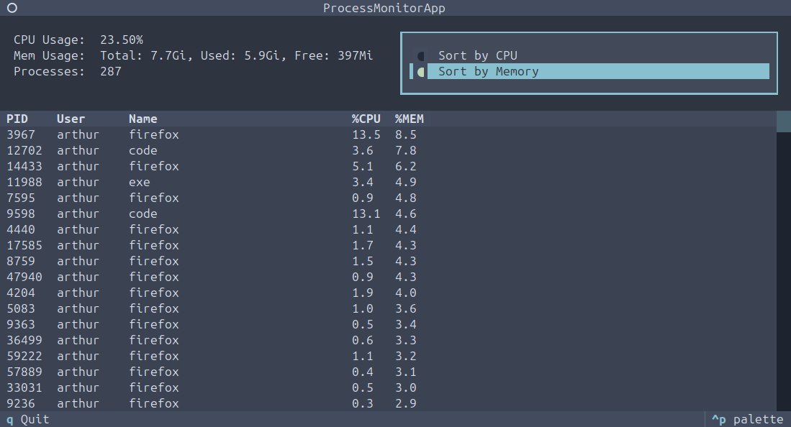

# Monitor de Processos em Terminal

Este é um monitor de processos e uso de recursos do desenvolvido para **Linux**. Ele exibe o uso de CPU, memória e uma lista de processos que pode ser ordenada em tempo real.  

Desenvolvido para a disciplina de sistemas operacionais pelo grupo 13:
- Arthur Costa
- Brendo Almeida
- Enzo Silva
- Pablo Pinheiro Castro

<br/>



## Funcionalidades

- Exibição do **uso atual da CPU.**
- Exibição do **uso de memória** (Total, Usada, Livre).
- Lista de **processos em execução** com PID, Usuário, Nome, %CPU e %MEM.
- **Ordenação** da lista de processos por consumo de **CPU** ou **Memória**.
- Atualização automática das informações.

## Implementação

O monitor foi construído em **Python** e utiliza as seguintes bibliotecas:

-   **Interface do Usuário:** A interface de usuário (UI) é criada e gerenciada com a biblioteca **[Textual](https://textual.textualize.io/)**. Textual é um framework que permite a criação de aplicações ricas e interativas diretamente no terminal.

-   **Coleta de Dados:** As informações sobre os recursos do sistema são obtidas através da execução de comandos de shell padrão do Linux, utilizando o módulo `subprocess` do Python.
    -   **Uso de CPU:** O dado é extraído do comando `mpstat 1 1`.
    -   **Uso de Memória:** As informações de memória total, usada e livre são extraídas do comando `free -h`.
    -   **Lista de Processos:** A lista de processos é obtida e ordenada através do comando `ps aux`.

## Pré-requisitos

- **Python 3**
- **Sistema Operacional baseado em Linux** (o script utiliza comandos como `mpstat`, `free` e `ps` que são padrão em distribuições Linux).
- O comando `mpstat` pode não vir instalado por padrão em algumas distribuições. Para instalá-lo em sistemas baseados em Debian/Ubuntu, use:
  ```bash
  sudo apt-get install sysstat
  ```

## Como Usar

1.  **Clone o repositório:**

2.  **Crie e ative um ambiente virtual (recomendado):**
    ```bash
    python3 -m venv .venv
    source .venv/bin/activate
    ```

3.  **Instale as dependências:**
    ```bash
    pip install textual
    ```

4.  **Execute:**
    ```bash
    python monitor.py
    ```
